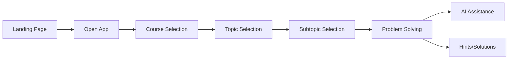

# Product Requirements Document (PRD)
## Math Learning Platform

### 1. Executive Summary

**Product Name:** Math Learning Platform  
**Version:** 1.0  
**Date:** January 2025  
**Status:** Initial Development

**Vision:** Create an integrated learning ecosystem that replaces ineffective traditional math education methods with active, efficient learning through seamlessly connected problems, notes, and AI assistance.

**Mission:** Enable motivated college students to learn mathematics effectively by providing structured learning paths, conceptual clarity, and adaptive practice with immediate access to explanations.

---

### 2. Problem Statement

Traditional college-level mathematics education fails students through:
- Boring, ineffective lectures that don't engage students
- Lengthy textbooks without clear learning pathways
- Insufficient problem-solving practice time
- Poor integration between learning materials and practice problems
- Lack of immediate help when stuck on concepts

---

### 3. Target Users

**Primary Persona: The Motivated Struggler**
- College student taking Calculus I or II
- Puts in effort but not seeing proportional grade improvements
- Wants to learn efficiently without wasting time
- Needs better resources than their current instructor provides
- Values clear explanations and guided practice

**Secondary Personas:**
- **Efficiency Seekers:** Want maximum learning with minimum time investment
- **Quality-Deprived Students:** Stuck with poor instructors, need alternatives

---

### 4. User Journey



**Detailed Flow:**

1. **Discovery Phase**
   - User lands on homepage
   - Views value proposition and benefits
   - Clicks "Open App" CTA

2. **Navigation Phase**
   - Selects between Calculus I or Calculus II
   - Views ~5 main topics per course
   - Selects specific subtopic to study

3. **Learning Phase**
   - Views one problem per page
   - Can navigate between problems easily
   - Accesses hints and solutions as needed
   - Uses AI assistant for explanations

4. **Practice Phase**
   - Works through problem sets
   - Tracks progress and weak areas
   - Reviews connected notes when stuck

---

### 5. Core Features

#### 5.1 Landing Page
**Purpose:** Convert visitors to users by clearly communicating value

**Requirements:**
- Hero section with clear value proposition
- Problem/solution presentation
- Benefits for target users
- Single prominent "Open App" CTA
- Mobile responsive design

**Success Metrics:**
- Click-through rate to app > 40%
- Time to click < 30 seconds

#### 5.2 Course Selection Interface
**Purpose:** Guide users to relevant content quickly

**Requirements:**
- Two clear options: Calculus I and Calculus II
- Visual differentiation between courses
- Brief description of topics covered
- Progress indicators for returning users

**Success Metrics:**
- Selection time < 5 seconds
- Zero confusion about course content

#### 5.3 Topic Navigation
**Purpose:** Hierarchical navigation through mathematical concepts

**Requirements:**
- Display 5 main topics per course
- Expandable subtopics under each main topic
- Visual indicators for:
  - Completed topics
  - Topics in progress
  - Locked/available topics
- Search functionality for quick access

**Success Metrics:**
- Navigation to desired topic < 15 seconds
- Topic completion rates > 60%

#### 5.4 Problem Viewer
**Purpose:** Present problems with optimal learning experience

**Requirements:**
- One problem per page display
- LaTeX rendering for mathematical expressions
- Navigation controls:
  - Previous/Next buttons
  - Jump to problem number
  - Progress indicator (e.g., "Problem 3 of 15")
- Problem metadata display:
  - Difficulty level
  - Topic tags
  - Estimated time

**Success Metrics:**
- Problem completion rate > 70%
- Average time per problem < 10 minutes

#### 5.5 Hints & Solutions System
**Purpose:** Provide graduated help to maintain learning challenge

**Requirements:**
- Expandable/collapsible containers
- Progressive reveal:
  - Hint 1 → Hint 2 → Full Solution
- Solution includes:
  - Step-by-step explanation
  - Linked concepts
  - Common mistakes to avoid
- Track hint/solution usage for analytics

**Success Metrics:**
- Hint usage before solution > 60%
- Problem retry after hint > 40%

#### 5.6 AI Assistant Sidebar
**Purpose:** Provide personalized, contextual help on demand

**Requirements:**
- Persistent right sidebar (collapsible on mobile)
- Chat interface with message history
- Context awareness:
  - Current problem
  - User's progress
  - Previous questions
- Drag-and-drop text from problems/solutions
- Quick action buttons:
  - "Explain this step"
  - "Give me a similar problem"
  - "Why is this important?"

**Success Metrics:**
- User engagement rate > 50%
- Satisfaction score > 4.5/5
- Average response helpfulness > 80%

---

### 6. Information Architecture

```
Home
├── Landing Page
└── App
    ├── Course Selection
    │   ├── Calculus I
    │   │   ├── Limits
    │   │   │   ├── Limits of Functions
    │   │   │   ├── Continuity
    │   │   │   └── ...
    │   │   ├── Derivatives
    │   │   ├── Applications
    │   │   ├── Integration
    │   │   └── Basics of Functions
    │   └── Calculus II
    │       ├── Advanced Integration
    │       ├── Sequences and Series
    │       ├── ODEs
    │       └── ...
    └── User Dashboard (Phase 2)
        ├── Progress Tracking
        ├── Weak Areas
        └── Study History
```

---

### 7. Non-Functional Requirements

#### 7.1 Performance
- Page load time < 2 seconds
- LaTeX rendering < 500ms
- AI response time < 3 seconds
- Smooth animations at 60fps

#### 7.2 Accessibility
- WCAG 2.1 AA compliance
- Keyboard navigation support
- Screen reader compatibility
- High contrast mode option

#### 7.3 Browser Support
- Chrome (last 2 versions)
- Firefox (last 2 versions)
- Safari (last 2 versions)
- Edge (last 2 versions)

#### 7.4 Responsive Design
- Desktop: 1920px, 1440px, 1024px
- Tablet: 768px
- Mobile: 375px, 414px

---

### 8. Success Metrics

#### 8.1 User Engagement
- Daily Active Users (DAU)
- Session duration > 20 minutes
- Problems attempted per session > 5
- Return rate (next day) > 40%

#### 8.2 Learning Outcomes
- Problem completion rate
- Improvement in problem-solving speed
- Reduction in hint usage over time
- Topic mastery progression

#### 8.3 Product Health
- Page load performance
- Error rate < 0.1%
- AI assistant satisfaction score
- User retention (30-day)

---

### 9. Future Enhancements (Phase 2)

- **Adaptive Learning:** Personalized problem recommendations
- **Progress Analytics:** Detailed performance tracking
- **Social Features:** Study groups, leaderboards
- **Content Expansion:** Additional courses beyond Calculus
- **Mobile App:** Native iOS/Android applications
- **Instructor Tools:** Class management features
- **Advanced AI:** Problem generation, step validation

---

### 10. Technical Constraints

- Must integrate with existing Supabase backend
- Must support LaTeX rendering efficiently
- Must handle concurrent users (initial target: 1000)
- Must maintain user state across sessions
- Must work offline for basic features

---

### 11. Launch Strategy

**Phase 1 (MVP):** 
- Core problem-solving interface
- Basic AI assistance
- Calculus I content

**Phase 2:**
- Full Calculus I & II content
- Enhanced AI features
- Progress tracking

**Phase 3:**
- User accounts and personalization
- Social features
- Additional mathematics courses